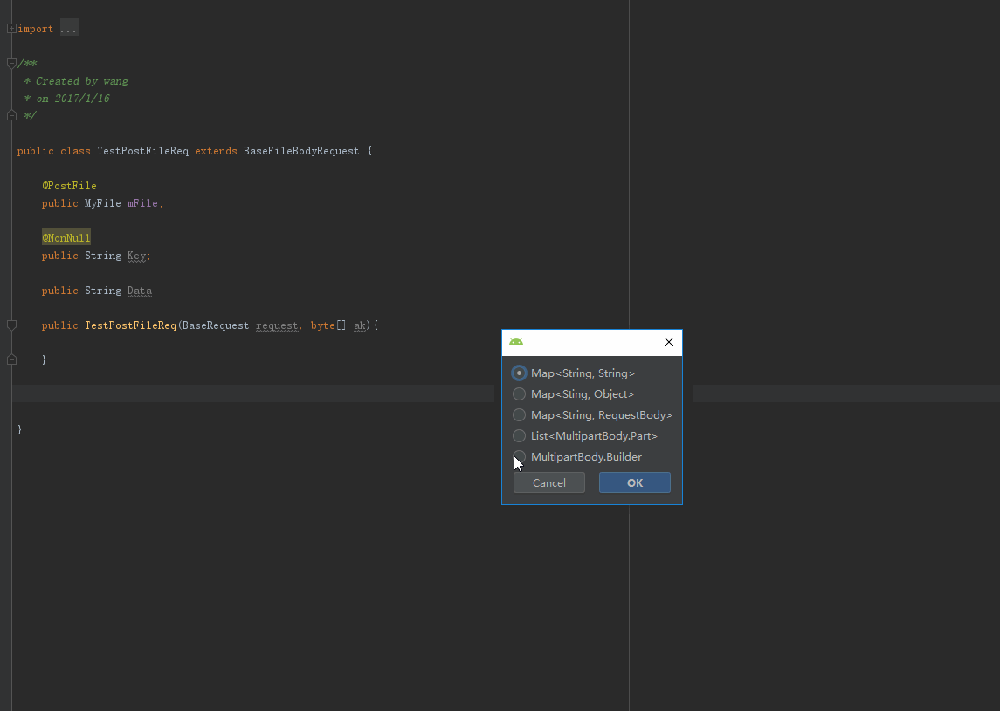
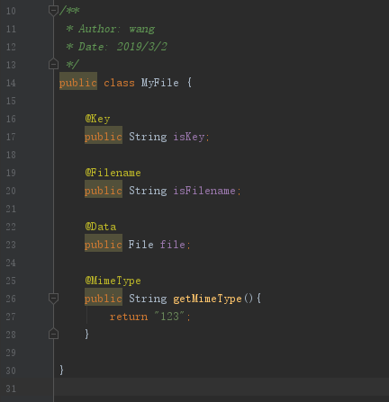

# OkHttpParamsGet #
[中文](https://github.com/kingwang666/OkHttpParamsGet/blob/master/README_CN.md)  
Help you to get Okhttp request params. Support Kotlin
</img> </img>

## How to install ##
File->Settings->Browse Repositories->OkHttpParamsGet

## Support ##
      
1. Map&lt;String, String&gt;  
2. Map&lt;String, Object&gt;
3. Map&lt;String, RequestBody&gt;
4. List&lt;MultipartBody.Part&gt;
5. MultipartBody.Builder
## How to use ##
1. Choose a class.
2. Press Alt + P or click the Generate menu choose GetParams.
3. Choose a type.
4. click ok.
## ps ##
- @Ignore: dont add to params
- @PostFile: post a file 
- @PostFiles: post files
- @Key: post file key
- @Filename: post file filename
- @MimeType: post file mime-type
- @Data: post file data.  
These annotations can be in any package

## update ##
<ul>
         <li>
            1.5.2(2019-06-24):
            <ol>
                <li>Replace HashMap with ArrayMap</li>
            </ol>
         </li>
         <li>
            1.5.1(2019-03-30):
            <ol>
                <li>Fix array to string bug. Now user Arrays.toString()</li>
            </ol>
        </li>
        <li>
            1.5.0(2019-03-02):
            <ol>
                <li>Support Kotlin.</li>
                <li>Support null check. When the value is null, you can either add or add as an empty string.</li>
                <li>Support Map&lt;String, Object&gt;</li>
                <li>You can customize the class that uploads the file. You can use annotations on the property or method to identify the key filename of the uploaded file mime-type and data.</li>
                <li>
                    add annotations:
                    <ol>
                        <li>@Key: post file key.</li>
                        <li>@Filename: post file filename.</li>
                        <li>@MimeType: post file mime-type.</li>
                        <li>@Data: post file data.</li>
                    </ol>
                </li>
            </ol>
        </li>
        <li>
            1.4.0(2017-08-17):
            <ol>
                <li>Auto import class.</li>
            </ol>
        </li>
        <li>
            1.3.0(2017-06-15):
            <ol>
                <li>Update the params name.</li>
                <li>Add get body. This type is return MultipartBody.Builder. You can build a RequestBody and set upload progress listener.</li>
            </ol>
        </li>
        <li>
            1.2.0(2017-03-09):
            <ol>
                <li>Update Id.</li>
                <li>Fix keyboard shortcut cannot use.</li>
                <li>Fix annotations useless bug.</li>
                <li>Fix a AnActionEvents bug. This is because IntelliJ API doesn't allow sharing AnActionEvents between swing events.</li>
            </ol>
        </li>
        <li>
            1.1.0(2017-03-08):
            <ol>
                <li>Optimized the code display</li>
            </ol>
        </li>
        <li>
            1.0(2017-03-08):
            <ol>
                <li>
                    add annotations:
                    <ol>
                        <li>@Ignore: dont add to params</li>
                        <li>@PostFile: post a file</li>
                        <li>@PostFiles: post files</li>
                    </ol>
                </li>
                <li>
                    <a href="https://github.com/kingwang666/OkHttpParamsGet/blob/master/extra/FileInput.java">FileInput</a>: upload File class
                </li>
            </ol>
        </li>
</ul>

### url ###
[OkHttpParamsGet](https://plugins.jetbrains.com/plugin/9545-okhttpparamsget)