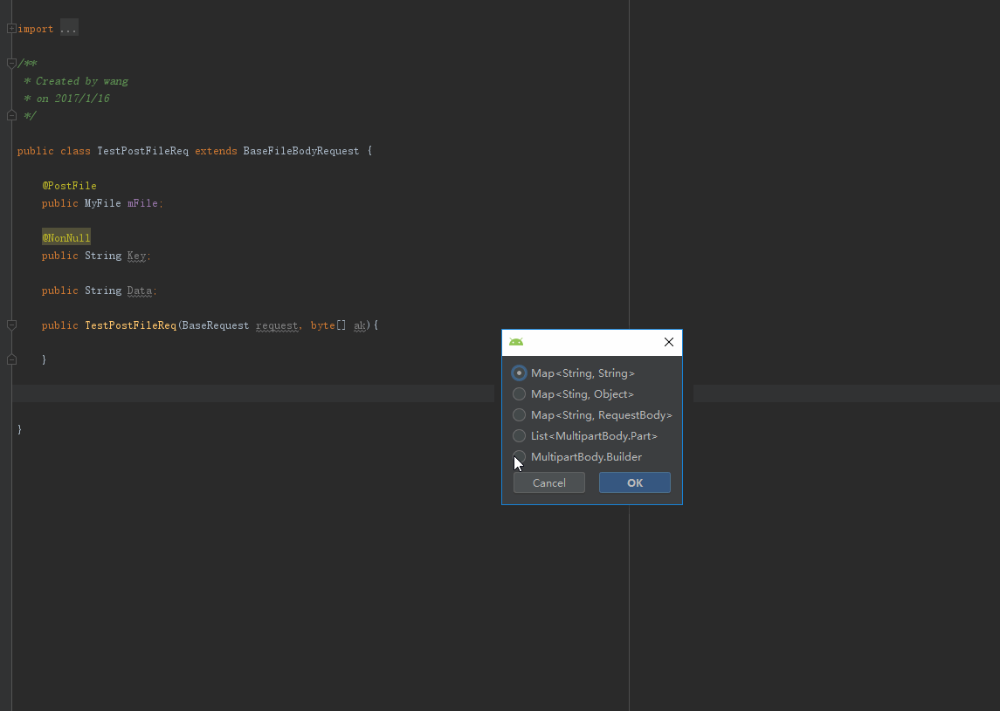

# OkHttpParamsGet #
帮助你自动生成Okhttp请求参数，支持kotlin。
</img> </img>

## How to install ##
File->Settings->Browse Repositories->OkHttpParamsGet

## Support ##
      
1. Map&lt;String, String&gt;  
2. Map&lt;String, Object&gt;
3. Map&lt;String, RequestBody&gt;
4. List&lt;MultipartBody.Part&gt;
5. MultipartBody.Builder
## How to use ##
1. 选择一个文件
2. 快捷键 Alt + P 或者 右键Generate点击GetParams
3. 选择一个生个参数类型
4. 点击ok
## ps ##
- @Ignore: 不添加进自动生成的请求参数中
- @PostFile: 单个文件参数
- @PostFiles: 多个文件参数
- @Key: 上传文件的Key值
- @Filename: 上传文件的文件名
- @MimeType: 上传文件的mime-type
- @Data: 上传的文件  
这些注解可以放在任何包下

## update ##
<ul>
        <li>
            1.5.1(2019-03-30):
            <ol>
                <li>修复数组转化为string的bug。 现在数组使用Arrays.toString()</li>
            </ol>
        </li>
        <li>
            1.5.0(2019-03-02):
            <ol>
                <li>支持kotlin</li>
                <li>支持空检测。当数据为空时可以不添加或者添加为空字符串</li>
                <li>支持 Map&lt;String, Object&gt;</li>
                <li>可以自定义上传的文件类。 你可以用注解来标注属性或者方法为上传的key值、文件名、mime-type和上传的文件</li>
                <li>
                    增加注解:
                    <ol>
                        <li>@Key: 上传文件的Key值</li>
                        <li>@Filename: 上传文件的文件名</li>
                        <li>@MimeType: 上传文件的mime-type</li>
                        <li>@Data: 上传的文件</li>
                    </ol>
                </li>
            </ol>
        </li>
        <li>
            1.4.0(2017-08-17):
            <ol>
                <li>自动导入</li>
            </ol>
        </li>
        <li>
            1.3.0(2017-06-15):
            <ol>
                <li>U更新参数名称</li>
                <li>增加生成RequestBody。返回类型为 MultipartBody.Builder. 你可以构建一个RequestBod并且设置上传进度监听</li>
            </ol>
        </li>
        <li>
            1.2.0(2017-03-09):
            <ol>
                <li>更新ID</li>
                <li>修复快捷键无法使用</li>
                <li>修复注解无用bug</li>
                <li>修复一个AnActionEvents错误。这是因为IntelliJ API不允许在swing事件之间共享actionevent</li>
            </ol>
        </li>
        <li>
            1.1.0(2017-03-08):
            <ol>
                <li>格式化代码输出</li>
            </ol>
        </li>
        <li>
            1.0(2017-03-08):
            <ol>
                <li>
                    增加注解:
                    <ol>
                        <li>@Ignore: 不添加进自动生成的请求参数中</li>
                        <li>@PostFile: 单个文件参数</li>
                        <li>@PostFiles: 多个文件参数</li>
                    </ol>
                </li>
                <li>
                    <a href="https://github.com/kingwang666/OkHttpParamsGet/blob/master/extra/FileInput.java">FileInput</a>: 上传的文件类
                </li>
            </ol>
        </li>
</ul>

### url ###
[OkHttpParamsGet](https://plugins.jetbrains.com/plugin/9545-okhttpparamsget)